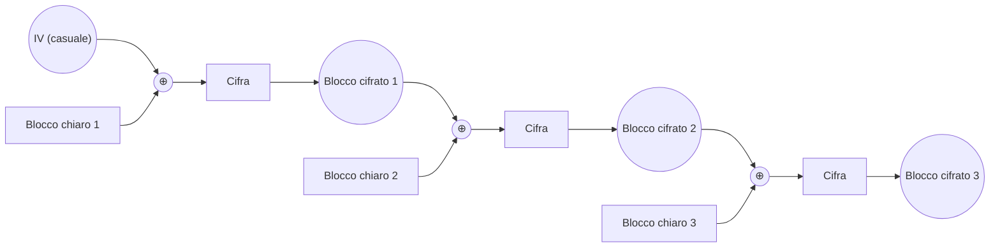

---
{"dg-publish":true,"permalink":"/sicurezza-informazione-m/4-cifrarisimmetrici/cbc-cipher-block-chaining/"}
---

#modalitàcifratura #algoritmo 

È la modalità più comunemente usata e prevede che **ogni blocco di testo cifrato dipenda da tutti i blocchi precedenti di testo in chiaro**.

Si procede nel seguente modo:
1. Il messaggio viene suddiviso in blocchi
2. Nell'ultimo blocco viene *aggiunto del padding*
3. Per <u>ridurre il determinismo</u> si fa in modo che **ogni blocco di testo cifrato dipenda anche da tutti i precedenti** 
		Viene aggiunto un **blocco di inizializzazione IV** non segreto con valore casuale, imprevedibile e usato solo una volta
			IV può essere precondiviso o allegato al messaggio
4. L'IV viene **posto in XOR con il primo blocco di testo in chiaro** prima di essere cifrato
5. Il testo cifrato passa al secondo blocco -> viene **posto in XOR con la parte di messaggio in chiaro relativa a tale blocco prima di cifrarla** 

| **PRO**                                                                                                                                          | **CONTRO**                                                                                         |
| ------------------------------------------------------------------------------------------------------------------------------------------------ | -------------------------------------------------------------------------------------------------- |
| **Non determinismo** <u>solo se il vettore IV è casuale, imprevedibile e usato una sola volta</u> -> altrimenti vulnerabile a *chosen plaintext* | **Meno efficiente di ECB** -> niente esecuzione parallela **MA** la decifratura è parallelizzabile |
| **Non malleabile** perchè **non deterministico**                                                                                                 | **C'è propagazione degli errori nel cifrato**                                                      |
|                                                                                                                                                  | **Padding** -> overhead                                                                            |
