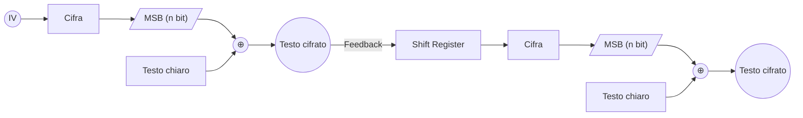

---
{"dg-publish":true,"permalink":"/sicurezza-informazione-m/4-cifrarisimmetrici/cfb-cipher-feedback/"}
---

#modalitàcifratura #algoritmo 

La modalità CFB ricorda un [[sicurezza-informazione-M/4-cifrarisimmetrici/Cifrari a flusso#Cifrari a flusso autosincronizzanti\|cifrario a flusso autosincronizzante]]. Essa prevede due *shift register* e **permette di cifrare un numero** **`n << N` bit alla volta**, dove **`n`** rappresenta la **dimensione del blocco**. 

**Nella modalità CFB deve essere precondivisa una chiave `k` ed un vettore di inizializzazione IV**

Si procede nel seguente modo:
1. Il primo *shift register* viene impostato al vettore di inizializzazione IV
2. Ad ogni passo, **il suo contenuto viene cifrato secondo la chiave**, generando `N` bit cifrati e salvati in *un altro shift register*
3. **Gli `n` bit più significativi** di questo secondo shift register sono quindi usati per cifrare un blocco del messaggio tramite XOR
4. Il risultato sarà il primo blocco cifrato di `n` bit, inseriti poi come bit meno significativi del primo shift register
5. Si procede così anche per i blocchi successivi, che saranno cifrati sempre con bit diversi -> si <u>riduce determinismo</u> 

| **PRO**                                                                                                | **CONTRO**                                                                                                                                                               |
| ------------------------------------------------------------------------------------------------------ | ------------------------------------------------------------------------------------------------------------------------------------------------------------------------ |
| **Possibile parallelizzare operazione di decifrazione** riempiendo opportunatamente gli shift register | **C'è propagazione degli errori nel cifrato** -> essa <u>dura per un solo transitorio</u>, dipendente dalla lunghezza del primo shift register #highpriority             |
| **Non richiede aggiunta di padding** -> il register darà sempre bit sufficienti per la funzione $E$    | Per un canale rumoroso non è la modalità ideale perché la continua modifica provocherebbe un transitorio di errore costante, quindi molto dispendioso. #highpriority  |
| Essendo **simile ad un cifrario a flusso** può essere usato per **comunicazioni in tempo reale**       |                                                                                                                                                                          |
Viene usato solitamente per la **trasmissione di caratteri mediante flusso di dati**

