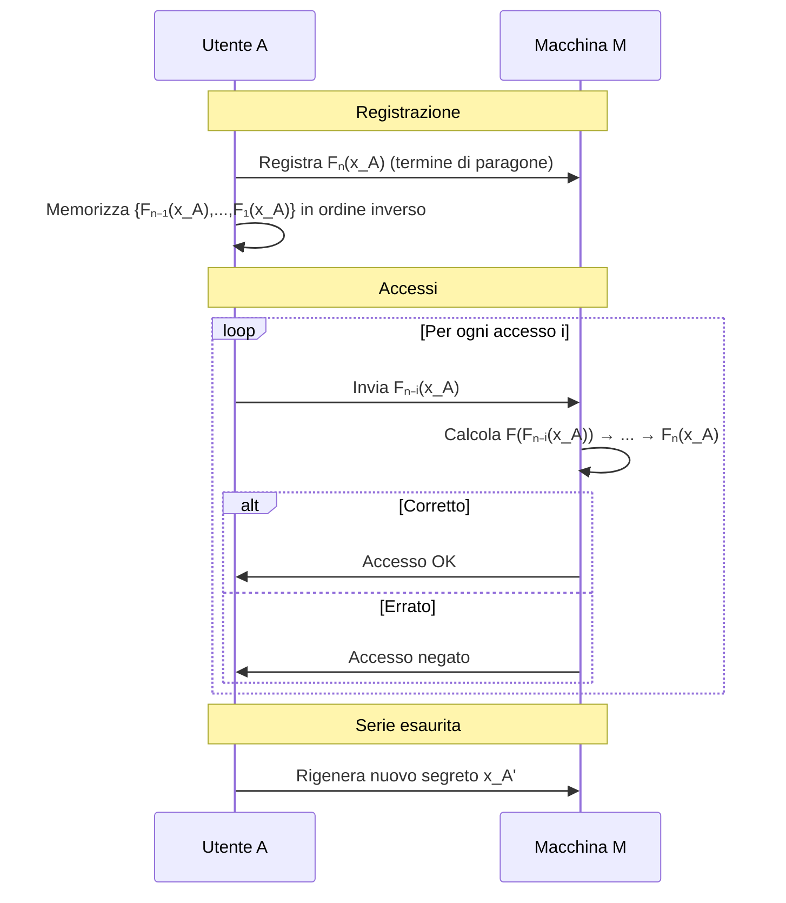

---
{"dg-publish":true,"permalink":"/sicurezza-informazione-m/7-identificazione/one-time-password/"}
---

#protocollo #identificazione 

Permette di utilizzare una pwd differente ad ogni sessione di identificazione -> il calcolo del nuovo segreto deve essere efficiente e one way.

### Funzionamento del protocollo

1. In fase di registrazione $A$ sceglie un <u>segreto</u> $x_A$ e mediante una funzione $F(x)$ (unidirezionale) genera una serie di valori $$\{F_1(x_A),...,F_n(x_A)\}$$
2. Il valore $F_n(x_A)$ viene memorizzato sulla macchina $M$ e costituisce il *termine di paragone per le password* -> i restanti valori vengono memorizzati in **ordine inverso** da $A$

3. Al primo accesso, $A$ comunicherà ad $M$ il valore $F_{n-1}(x_A)$ e a sua volta $M$ provvederà ad applicare a questo valore la funzione $F$ producendo $F_n(x_A)$ -> se il risultato coincide con il termine di paragone, $A$ risulta identificato

4. Ad ogni nuova identificazione $A$ comunicherà via via i valori precedenti e $M$ provvederà ad applicare $F$ tante volte quanti sono stati i precedenti accessi

5. Terminata la serie di valori è necessario concordare un nuovo segreto e ripetere da capo l’intera procedura

---

---

| ***PRO***                                                               | ***CONTRO***                                                  |
| ----------------------------------------------------------------------- | ------------------------------------------------------------- |
| Schema robusto -> si basa sulla <u>non invertibilità di F</u>           | Quando finiscono le $n$ prove bisogna rifare la registrazione |
| Il verifier non può spacciarsi per A usando le prove di identificazione |                                                               |
