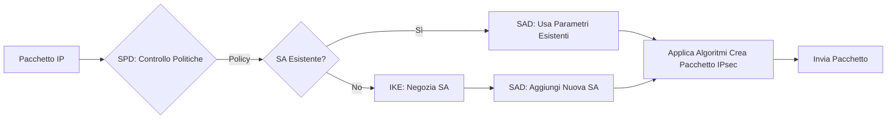

---
{"dg-publish":true,"permalink":"/sicurezza-informazione-m/8-sicurezzadistribuita/ip-sec/"}
---

#protocollo  #identificazione #highpriority 

SSL garantisca la sicurezza delle comunicazioni a livello applicativo. **IPSec**, invece, **si colloca a livello IP (Network)**, e permette di risultare completamente trasparente alle applicazioni.

Il **protocollo IP non è assolutamente protetto** -> vulnerabile ad attacchi come:
- *Packet sniffing*
- *IP spoofing*
- *Connection hijacking*

IPSec e le sue varie componenti hanno lo scopo di garantire, a livello di pacchetti IP:
- **Integrità dei datagrammi** 
- **Autenticazione dell'indirizzo IP del mittente** -> origine dei dati -> i certificati scambiati riguardano un indirizzo IP
- **Rifiuto dei pacchetti di replica**
- **Confidenzialità totale o parziale del flusso di traffico**

> Utilizzando IPSec anche applicazioni non sicure possono utilizzare la rete con sicurezza

La suite IPSec è composta da tre protocolli principali:
1. **Internet Key Exchange (IKE)** -> utilizzato per la <u>negoziazione</u> dei parametri di sicurezza, delle chiavi di cifratura e delle modalità di impiego 
	- Protocollo di autenticazione simile ad SSL -> si certificano IP sia di client che di server 
	- Scelta della modalità di comunicazione tra AH ed ESP
2. **Authentication Header (AH)** -> <u>autenticazione</u> ed <u>integrità</u> dei pacchetti -> **COMUNICAZIONE AUTENTICATA**
3. **Encapsulating Security Payload (ESP)** -> <u>confidenzialità</u> (parziale e totale) + autenticazione e integrità -> **COMUNICAZIONE CIFRATA**

> **AH ed ESP possono essere usate indipendentemente l'una dall'altra** -> ESP senza AH è però molto vulnerabile -> viene utilizzata di rado

---
# Componenti architetturali
### Security Association (SA)

È una struttura dati che **identifica** in maniera univoca un <u>canale di comunicazione unidirezionale</u> -> se si vuole ottenere un canale *bidirezionale* bisogna usare due SA

Al suo interno contiene:
- **Security Parameter Index (SPI)** -> id univoco della SA 
- **Indirizzo IP destinatario**
- **Id del protocollo usato** -> AH o ESP
- **Modalità di impiego IPSec** -> tunnel o transport
### Security Policy Database (SPD)

È un database che contiene le **politiche di controllo del traffico** e definisce come dovrà essere trattato un pacchetto IPSec. 

Ogni politica opera sulla base di selettori come indirizzi IP mittente e destinatario, porte sorgente e destinazione.
### Security Association Database (SAD)

**Database che contiene i parametri associati ad ogni SA**. È organizzato ad entry per cui, <u>per ogni SA</u>, ci sono le informazioni che sono state negoziate e permettono di gestire quella particolare SA -> chiavi di cifratura, algoritmi etc.
## Workflow

In fase di ricezione ci sarà come prima cosa il **controllo anti-replica**, e se si verifica che il pacchetto non è replicato il pacchetto IPsec verrà riportato nello stato di pacchetto IP originario -> poi SA per quel pacchetto -> SAD per estrazione chiavi e decifrare il pacchetto -> SPD per estrarre la politica di gestione.

> **INVIO**: IP -> SPD -> SA -> SAD
> **RICEZIONE**: IP -> SA -> SAD -> SPD

---
# Modalità di impiego

## Modalità Transport

Prevede la **comunicazione diretta tra le due stazioni**, ciascuna delle quali tratta e spedisce i propri pacchetti tramite IPSec e quindi che il pacchetto IPSec sia **direttamente instradabile su una rete pubblica**. 

In questa modalità un pacchetto IPSec è costruito così:
- Header del pacchetto IP originale (non cifrato)
- Ulteriore header IPSec con informazioni del protocollo
- Payload del pacchetto originale protetto

Visto che in questa modalità gli indirizzi IP della sorgente e della destinazione sono visibili nell’header del pacchetto IP originale, ogni nuovo pacchetto IPSec sarà instradabile direttamente -> in tutte le configurazioni disponibili (end-point end-point, end-point gateway, gateway gateway)
## Modalità Tunnel

Prevede la **presenza di almeno un gateway** detto <u>"security gateway"</u> che faccia da tramite. 

In questa modalità un pacchetto IPSec è costruito così:
- Nuovo header creato da IPSec con IP sorgente e destinazione diversi
- L'intero pacchetto IP originale protetto

Dato che gli indirizzi IP originali vengono nascosti, questa modalità <u>non può essere usata con le configurazioni end-point to end-point</u> perchè il nuovo indirizzo IP può appartenere solo ad un gateway.

**La modalità tunnel è la tipica modalità con cui viene realizzata una VPN** e presenta due differenti varianti: 
1. **Variante Road Warrior** -> permette ad una *macchina esterna* (il road warrior appunto) di *comunicare con un gateway dietro a cui si trova una rete sicura*
2. **Variante comunicazione diretta** -> prevede la *comunicazione diretta tra due gateway*, permettendo così di connettere in maniera sicura due reti separate creandone una singola virtuale

---
# Protocollo AH (Authentication Header)

Questo protocollo serve solamente per l’**autenticazione dei pacchetti**. 

In base alla modalità utilizzata, il protocollo ha un funzionamento diverso:
- **Modalità Transport** -> si inserisce tra header IP e payload l'intestazione AH
- **Modalità Tunnel** -> viene creata una nuova intestazione per il pacchetto che <u>contiene solo gli estremi del tunnel</u> -> si autentica tutto il pacchetto, replicandolo dopo l'header di AH

Dato che **alcuni campi dell'intestazione sono variabili**, non potrebbero essere autenticati -> ***vengono azzerati per l'autenticazione***

L'integrità e l’autenticità del pacchetto **ICV** (***Integrity Check Value***), è ottenuta mediante l’uso di [[sicurezza-informazione-M/8-sicurezzadistribuita/HMAC\|HMAC]] e di un segreto condiviso tra le due parti comunicanti ed associato univocamente alla SA; questo dato viene poi inserito all’interno dell’ultimo campo dell’intestazione.

---
# Protocollo ESP (Encapsulating Security Payload)

Questo protocollo  serve a **garantire la riservatezza dei dati**.

In base alla modalità utilizzata, anche qui il protocollo ha un funzionamento diverso: 
- **Modalità Trasport** -> si inserisce l’intestazione di ESP tra l’intestazione di IP ed il payload e si introduce in coda al pacchetto un segmento che chiude la sezione cifrata
- **Modalità Tunnel** -> come con AH, viene creata una nuova intestazione per IP e si procede a cifrare l’intero pacchetto originale -> in questo modo all’interno del pacchetto non solo si potranno usare gli indirizzi privati della rete, ma verrà anche impedito ad un osservatore di capire quali essi siano.

Per la riservatezza si procede in maniera simile come per l’autenticazione, ovvero utilizzando una chiave simmetrica condivisa per cifrare i dati:
- In Modalità Trasport viene cifrato ed autenticato il payload
- In Modalità Tunnel viene cifrato ed autenticato l’intero pacchetto originario

ESP applica il modello "***encrypt then authenticate***" -> così si può prima controllare l'autenticazione e poi decifrare i dati -> aumento dell'efficienza.

ESP può essere usato anche senza autenticazione -> sconsigliato tranne se si vuole solo migliorare l'efficienza di cifratura a livello applicativo.

---
# AH ed ESP

|                                  | ***Trasporto***                                                              | ***Tunnel***                                                                    |
| -------------------------------- | ---------------------------------------------------------------------------- | ------------------------------------------------------------------------------- |
| ***AH***                         | Autentica il payload + parti dell'header (IP mittente, SPI, numero sequenza) | Autentica l'intero pacchetto originario e porzioni specifiche di quello esterno |
| ***ESP***                        | Cifra il payload e le estensioni IPv6                                        | Cifra l'intero pacchetto originario                                             |
| ***ESP con autenticazione***  | Cifra il payload e le estensioni IPv6, autentica payload ma non header       | Cifra e autentica l'intero pacchetto originario                                 |

---
# Servizio anti-replica

IPSec è dotato di un servizio atto a proteggere la comunicazione da attacchi di replica. Si basa su:
- **Numeri di sequenza dei pacchetti** -> IPSec <u>non garantisce l’ordine di arrivo</u>
- Una **finestra scorrevole**

Questo meccanismo permette di verificare se un pacchetto IPSec in ricezione **è stato già precedentemente ricevuto**, quindi se è replicato oppure no.

L’*ampiezza* della finestra scorrevole è uno dei *parametri della Security Association*. Quando due entità, dopo aver avviato la Security Association, cominciano a inviare pacchetti, ogni pacchetto viene numerato inizialmente con un valore che parte da 0 e cresce costantemente. 

La finestra contiene quindi un intervallo di (ad esempio) 64 pacchetti (default ma modificabile), e ha un margine sinistro e un margine destro che sono variabili, essendo appunto, scorrevole. **La finestra scorre logicamente da sinistra verso destra sul flusso di dati**.

Quando un’entità riceve un pacchetto IPSec, va immediatamente ad estrarre da quest’ultimo il suo numero di sequenza e qui possono verificarsi vari casi: 

1. Il numero di sequenza del pacchetto **ricade nell’intervallo interno alla finestra** e **quel numero di sequenza è stato marcato come già ricevuto** -> si scarta

2. Il numero di sequenza del pacchetto **ricade nell’intervallo** interno alla finestra e quel numero di sequenza **non è marcato** come ricevuto -> viene controllata l’autenticità e l’integrità del pacchetto, e in caso di esito positivo il pacchetto viene accettato e lo slot relativo a quel numero di sequenza si marca come ricevuto

3. Il numero di sequenza del pacchetto non ricade nell’intervallo interno alla finestra, ma prima del margine sinistro della stessa ->  si scarta ->  si suppone appartenga ad un traffico già ricevuto

4. Il numero di sequenza del pacchetto non ricade nell’intervallo interno alla finestra, ma dopo il margine destro della stessa -> si fa **scorrere la finestra in avanti** in modo da avere quel numero di sequenza all’estremità destra della finestra, e si eseguono tutti i controlli previsti per un pacchetto con numero di sequenza che ricade all’interno della finestra. 

Una volta che il pacchetto è stato accettato dal servizio anti-replica si procede, se necessario, a decifrare il pacchetto
