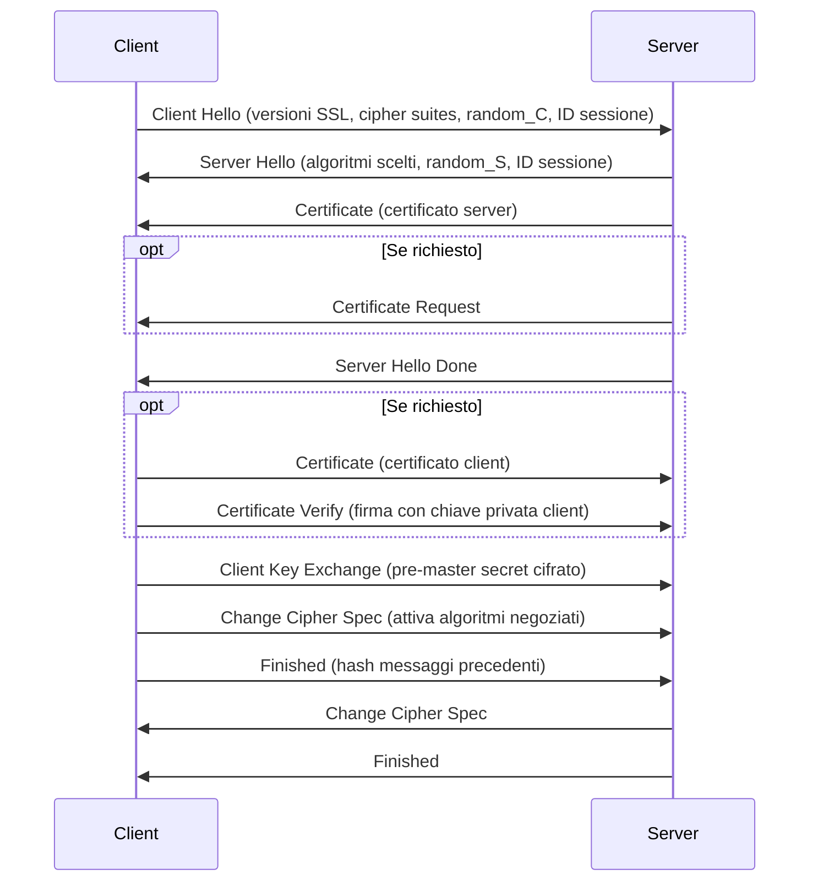

---
{"dg-publish":true,"permalink":"/sicurezza-informazione-m/8-sicurezzadistribuita/ssl-tls/"}
---

#protocollo #identificazione #highpriority 

Si tratta di una **suite di protocolli** (ne prevede 4), compresi tra il livello di trasporto e quello applicativo, che garantiscono **autenticazione** e **riservatezza** delle comunicazioni. 

Il primo supporto sicuro per applicazioni Internet, prese il nome di **SSL** (***Secure Sockets Layer***) ed è stato concepito per essere collocato tra il protocollo HTTP ed il sottostante strato di trasporto TCP. Lo standard Internet che discende da SSL è detto **TLS** (***Transport Layer Security***).

La sigla HTTPS indica un’applicazione HTTP che si avvale dei servizi di sicurezza di TLS. SSL garantisce quindi la confidenzialità e autenticità dei dati tramite un trasporto sicuro dei pacchetti TCP (anche integrità e identificazione). Si ottiene così **semitrasparenza per le applicazioni** (creando una ***socket sicura***) ed esse non devono così gestire la confidenzialità, integrità e autenticità dei dati in modo diretto, ma **tutto ciò verrà gestito da SSL**.

---
# Sessioni 

SSL si basa sul concetto di “**sessione sicura**”, ossia un’associazione logica tra un client ed un server, la quale può contenere al suo interno **una o più connessioni** che fungono da canale di trasporto. 

Si noti che ogni connessione può avere diverse caratteristiche e fare uso di diversi protocolli di sicurezza. Ogni sessione è creata dal protocollo di handshake e può essere considerata creata solo nel momento in cui il protocollo è concluso.

Ogni <u>sessione</u> è caratterizzata da: 
- **ID** univoco della sessione stessa
- **Certificato** (X.509) del nodo con cui si sta negoziando la connessione
- Il metodo di **compressione** dei dati
- Un cifrario e un algoritmo di **hash**
- La **chiave** di sessione (*master secret*) a 48 bit

Ogni singola <u>connessione</u> è invece caratterizzata da:
- **Numeri casuali** per client e server -> per evitare *replay attacks*
- **Chiavi di cifratura dei dati** -> derivate dalla chiave di sessione
- **Chiavi per la creazione dell'autenticatore con HMAC**
- **Vettore di inizializzazione (IV) del cifrario simmetrico** -> in caso si usino modalità come [[sicurezza-informazione-M/4-cifrarisimmetrici/CBC (Cipher Block Chaining)\|CBC (Cipher Block Chaining)]]
- **Numeri di sequenza** per riordinare i messaggi

SSL è nato per lavorare su Internet, ovvero un ambiente completamente libero in cui client e server non si conoscono; pertanto, ***le chiavi vengono sempre concordate tramite lo scambio [[sicurezza-informazione-M/4-cifrarisimmetrici/Protocollo Diffie-Hellman\|Diffie-Hellman]] (e varianti) o con un [[sicurezza-informazione-M/6-cifrariRSA/Cifrario Ibrido\|Cifrario Ibrido]] e mai tramite l’uso di un KDC***, perché quest’ultimo ha senso soltanto se si conoscono già a priori gli utenti che devono comunicare (essendo in Internet, ciò non è possibile). 

---
# Protocolli

Al livello di <u>trasporto</u> si ha il protocollo 
- ***Record*** -> definisce il formato dei messaggi per le comunicazioni sicure e si occupa di cifrare ed autenticare i dati scambiati durante la comunicazione

Al livello <u>applicativo</u> si hanno i protocolli: 
- ***Handshake*** -> serve a negoziare tra client e server i meccanismi di sicurezza 
	- questo passo è fondamentale in quanto il client, quando contatta un server, non sa a priori quali algoritmi di cifratura o quali funzioni hash supporta
	- con l’handshake è possibile negoziare i protocolli da usare e le chiavi da utilizzare per realizzare autenticazione e riservatezza
- ***Change Cipher Spec*** -> ha lo scopo di finalizzare la definizione dello stato di sessione e di rinegoziare i parametri della connessione
- ***Alert*** -> si occupa della comunicazione delle situazioni di errore

---
## Protocollo di handshake

Il protocollo di handshake viene utilizzato per stabilire la sessione o per modificarne i parametri. È composto da **4 fasi**:

1. **Accordo sugli algoritmi** -> client e server si accordano sui meccanismi per la riservatezza, il client propone quali supporta e il server ne sceglie uno -> cifrari RSA, DH e varianti etc

2. **Autenticazione del server** -> il server si autentica presso il client e, utilizzando un cifrario ibrido o DH vengono scambiate le chiavi
	- <u>Server certificate</u> -> se servono ulteriori informazioni `server key exchange` -> se il client si deve autenticare `certificate request`
	- Verifica i certificati <u>solo per firma e data di validità</u> -> **non viene verificato lo stato di revoca**
		- Il solo invio del certificato in DH non basta ad autenticare il server -> servono operazioni di cifratura e firma

3. **Autenticazione del client (opzionale)** -> se nella fase precedente il server l'ha richiesto, il client si autentica

4. **Controlli finali** -> vengono controllati tutti i dati scambiati, anche mediante l’utilizzo del protocollo Change Cipher Spec per creare l’autenticatore -> controlla leggittimità di client e server vedendo se hanno scambiato la stessa chiave

---
## Protocollo Record

Questo protocollo serve per garantire autenticazione, riservatezza e integrità. Vediamone gli step principali: 

1. Si inizia con la **frammentazione dei dati applicativi in blocchi**
2. Ognuno di questi viene **corredato dalla sua lunghezza e dal suo numero di sequenza**
3. Viene calcolato l’**[[sicurezza-informazione-M/8-sicurezzadistribuita/HMAC\|HMAC]] del messaggi**o in chiaro secondo il segreto condiviso
4. L’**autenticatore** così costruito viene **concatenato al messaggio** e il tutto viene cifrato
5. Lato **ricevente** vengono svolte le operazioni inverse di **decifrazione**, **ricalcolando l’autenticatore** e verificando che esso sia corretto

**Questa soluzione non risulta computazionalmente ottimizzata per il destinatario, in quanto questo è sempre obbligato a decifrare e quindi a calcolare l’autenticatore**. Sarebbe invece più efficiente poter prima svolgere la verifica dell’autenticità, avendo in questo modo la possibilità di scartare i dati (risparmiandone la decifrazione) se questi non sono autentici o corrotti.

---
